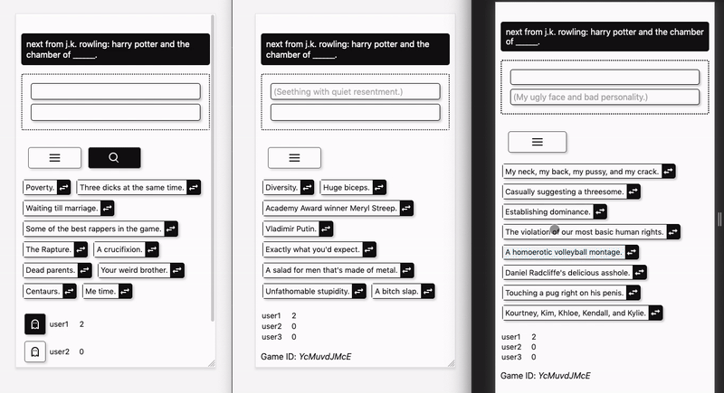

# Hateball

Card game



[Cards against humanity](https://en.wikipedia.org/wiki/Cards_Against_Humanity)

## Running

```
mix deps.get
npm install # (in ./assets)
mix phx.server
```

Go to [`localhost:4000`](http://localhost:4000)

Ready to run in production? Please [check our deployment guides](https://hexdocs.pm/phoenix/deployment.html).

## Deployment

To deploy run (on the machine where it's being deployed):

```bash
./scripts/clean.sh
MIX_ENV=prod ./scripts/build.sh
./scripts/run.sh
```
